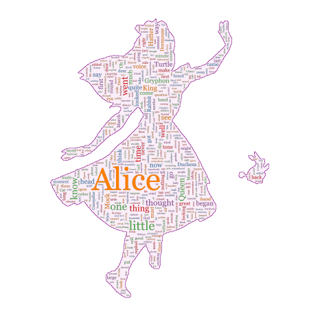
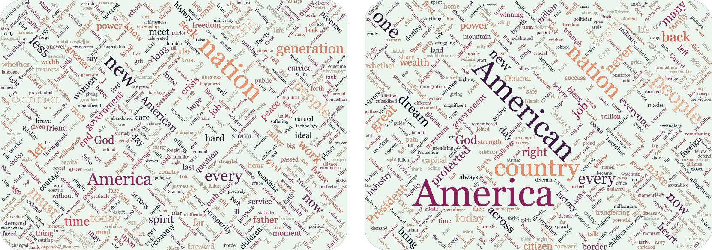

This package is a python wrapper for the julia package [WordCloud.jl](https://github.com/guo-yong-zhi/WordCloud.jl). Currently, the [Julia](https://julialang.org/) and [pyjulia](https://pyjulia.readthedocs.io/en/stable/) need to be installed by yourself.
# Basic Usage
```python
from wordcloud2 import wordcloud as W

words = "天地玄黄宇宙洪荒日月盈昃辰宿列张寒来暑往秋收冬藏闰余成岁律吕调阳云腾致雨露结为霜金生丽水玉出昆冈剑号巨阙珠称夜光果珍李柰菜重芥姜海咸河淡鳞潜羽翔龙师火帝鸟官人皇始制文字乃服衣裳推位让国有虞陶唐吊民伐罪周发殷汤坐朝问道垂拱平章"
words = list(words)
weights = [random.random()**2 * 100 + 30 for i in range(len(words))]
wc = W.wordcloud(words, weights)
wc.generate()
paint(wc, "qianziwen.svg")
```
# More Complex Usage
```python
from wordcloud2 import wordcloud as W

words, weights = W.processtext(open(W.pkgdir(W.WordCloud)+"/res/alice.txt").read(), 
              stopwords=set(W.stopwords_en).union({"said"}))
wc = W.wordcloud(
    words, weights,
    mask = W.loadmask(W.pkgdir(W.WordCloud)+"/res/alice_mask.png", color="#faeef8"),
    colors = ":Set1_5",
    angles = (0, 90),
    density = 0.55).generate()
new_background = W.outline(wc.getmask(), color="purple", linewidth=1)
wc.paint("alice.png", ratio=0.5, background=new_background)
```
[](./examples/alice.py)

# More Examples
## Training animation
[](./examples/animation.py)   
[Training Animation](./examples/animation.py)  
## Gathering style
[](./examples/gathering.py)  
[Gathering Style](./examples/gathering.py) 
## Comparison
[](./examples/compare.py)  
[Comparison of Obama's and Trump's Inaugural Address](./examples/compare.py)  
